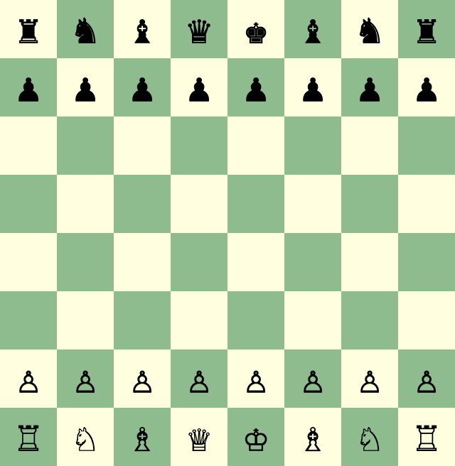

# Chess Explorer

This is a chess app built with vanilla JavaScript. It's an exercise to learn
web development fundamentals and chess strategy, using HTML, CSS, & JS.



## Exercise Constraints
- The game runs in the browser
- No libraries, frameworks, templates, or preprocessors
- Limited dev tools:
  - [Node.js](https://nodejs.org/)
  - [ESLint](https://www.npmjs.com/package/eslint)
  - [nodemon](https://www.npmjs.com/package/nodemon)

## Goals
- [x] Play locally
  - [x] Support basic movements of each piece
  - [x] Recognize check and mate
  - [ ] Recognize a draw
  - [x] Don't allow moves that put or leave the king in check
  - [x] Allow castling
  - [x] Allow en passant
  - [x] Promote pawns to queen
  - [ ] Promote pawns to rook, bishop, or knight
- [x] Document the game score in algebraic notation
- [ ] Play against another person remotely
- [ ] Play against an artificial opponent

## Development
Install the dependencies by running:
```sh
npm install
```
Start the node server with:
```sh
npm run dev
```
Identify syntax and style issues with:
```sh
npm run lint
```
Run automated tests with:
```sh
npm run test
```

[Pawn](https://icons8.com/icon/1009/pawn) icon by [Icons8](https://icons8.com)
